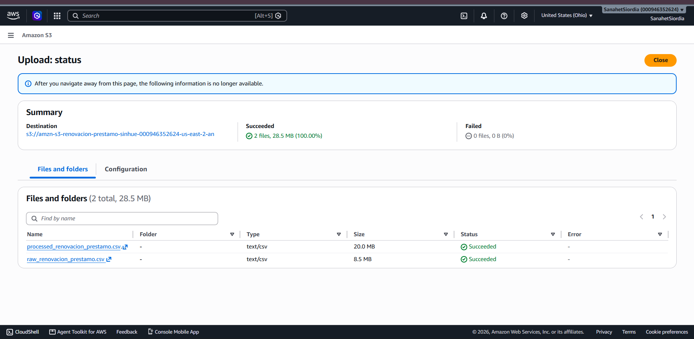

# renovacion_prestamo_fastapi
Proyecto integral de MLOPs End-To-End donde se analizan datos guardados en AWS S3 Bucket con Data Version Control (DVC) desde contenedores dockers que transforma los datos, compara diversos modelos de aprendizaje automatico supervizado y selecciona el  modelo con mejor recall y realiza fine tunning guardando todos los entrenamientos con MLFLOW. Por ultimó, se exporta el modelo en .pck, .skops y .json y se crea una aplicacion para prediccion con el framework FastAPI y se exportan los modelos y la API a Google Cloud Storage, Vertex AI y Artifact Registry. 

---

## 🛠️ Stack Tecnológico

[](#)


[](https://cloud.google.com/vertex-ai)
[](#)


---

## ⚙️ Requisitos Previos

- Python 3.10+
- Cuenta GitHub
- Docker
- Make
- Cuenta AWS
- Cuenta Google Cloud

### Instalación del entorno

```bash
# Clonar el repositorio
git clone https://github.com/SanehetSiordia/renovacion_prestamo_fastapi.git
cd renovacion_prestamo_fastapi
# Instalar AWS CLI con el comando en Powershell:
irm https://awscli.amazonaws.com/v2/install.ps1 | iex 
Documentacion: https://docs.aws.amazon.com/cli/latest/userguide/getting-started-install.html
#Verificar instalacion de AWS CLI:
aws --version
#Instalar DVC en equipo local con comando:
winget install --id Iterative.DVC
#Verificar DVC instalado:
dvc --version
# Ejecutar permisos para versionamiento con DVC en la terminal:
chmod +x entrypoint.sh
# Instalar Make con el comando en CMD:
winget install ezwinports.make
# Comprobar Make instalado con:
make --version
# Ejecutar comando Make
Make all
#Validar entornos virtuales desde Browser:
http://localhost:8085/          --FastApi Home
http://localhost:8085/docs      --FastApi OpenApi
http://localhost:8085/health    --FastApi Healthchek
http://localhost:5000/          --MLFLOW GUI
#Detener todo los contenedores y purgar cache con:
make down
#Para mayor informacion ejecutar comando make:
make help
```
---

## Plan a Futuro
- Revisar version de _pip install google-cloud-aiplatform_
 : **pip show google-cloud-aiplatform**
- Registro de Imagenes para prediccion en Vertex AI - **https://console.cloud.google.com/artifacts/docker/vertex-ai/us/prediction**
- Generar credenciales ADC en windows host: **gcloud auth application-default login**
- Abrir las credenciales %APPDATA%\gcloud\application_default_credentials.json
- Guardar las credenciales generadas a ruta /credentials/
- Agregar Ingesta Continua con Auto Loader con PySpark y Databricks


---
## 📂 Estructura del Repositorio
```text
.
├── .dvc/
│   └── config                      # Archivo de configuracion de ruta de los archivos fuentes con dvc
├── .github/workflows/
│   └── pipeline.yml                # Pipeline de CI/CD End-To-End (GitHub Actions) Rama Feature To Main
├── api/
│   ├── __init__.py                 
│   ├── app.py                      # Clase con las rutas principales http del fastapi
│   ├── predictor.py                # Clase con el cargado del modelo y pruebas de validacion
│   └── schemas.py                  # Clase con el esquema de las caracteristicas del modelo
├── artifacts/                      # Ruta donde se guardan los modelos generados con el entrenamiento local (.json,.pkl,.skops)
│   └── metrics.json                # Metricas resultantes del ultimo entrenamiento local del mejor modelo
├── data/                           # Ruta donde se descargan de S3 bucket los archivos .csv con "make download-aws"
│   ├── processed/processed_renovacion_prestamo.csv.dvc
│   └── raw/raw_renovacion_prestamo.csv.dvc
├── evidencias/
│   └── *.png                       # Evidencias de resultados en AWS S3 Bucket y GCP Bucket, Vertex-Ai y artifact-registry
├── mlruns/                         # Rutal que guarda los modelados con MLFLOW de forma local y automatica
├── notebooks/
│   └── notebook_renovacion_prestamo.ipynb
├── requirements/
│   ├── fastapi.txt                 # Librerias requeridas para la fase de FastAPI del proyecto
│   └── training.txt                # Librerias requeridas para la fase del entrenamiento del modelo
├── api/
│   ├── __init__.py                 
│   ├── manage_data.py              # Clase para limpieza y transformacion de los datos
│   ├── train_model.py              # Clase para entrenar los modelos y generar los artefactos finales
│   ├── manage_versions.py          # Clase para gestionar el versionamiento de los modelados con MLFLOW
│   └── validate_model.py           # Clase para validar y guardar las metricas del modelo final
└── tests/
    ├── __init__.py                 
    ├── test_data.py                # Clase para validar el formato del dataset procesado
    ├── test_model.py               # Clase para validar los metodos de entrenamiento del modelo
    └── test_pipeline.py            # Clase para validar las metricas finales del modelo para aprovar el CI/CD
```


---


## Visualización
Los datos de la capa Gold alimentan tableros interactivos para analizar los perfiles de clientes con mayor probabilidad de aceptación:



